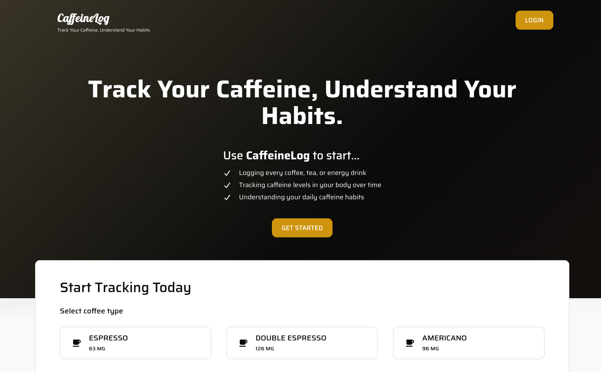

## CaffeineLog

A lightweight React + Firebase app to track your daily caffeine intake, view stats (daily caffeine, active caffeine level, costs), and browse your caffeine history. Designed to help users understand their consumption habits and make more informed choices.

---

# Screenshot



**Live demo:** https://caffeinelog.netlify.app/

---

## Features

- Log coffee consumption and caffeine intake.
- View daily and total stats for caffeine and cost.
- Track your top coffees and purchase history.
- Responsive and user-friendly dashboard.

---

## Tech stack

- React (Vite)
- Firebase
- CSS

---

## Installation

```bash
# clone
git clone https://github.com/MedBouali/caffeine-tracker-react.git
cd caffeine-tracker-react

# install dependencies
npm install

# run dev
npm run dev